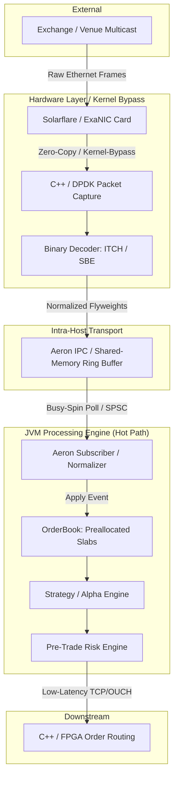

# hftrading

Plain `javac` / `java` prototype for a low-latency order book and CSV replay feeder.

## Architecture

Typical industry flow:

```text
Exchange feed
  -> C++/DPDK or FPGA capture
  -> compact event normalization
  -> Aeron IPC or shared memory ring
  -> Java order book / strategy / risk
  -> downstream consumers
```

### Component Topology Diagram



## Industry Best Practices & Architecture Choices

### 1. Zero-Allocation & Garbage Free Execution
In low-latency Java applications, Garbage Collection (GC) pauses are a primary source of tail latency (p99/p99.9). Best practices include:
- **Preallocated Object Pools / Slabs**: Flat primitive arrays containing preallocated POJOs (like the `Order` and `PriceLevel` slabs in this project) or direct off-heap memory.
- **Flyweight Pattern**: Reusing a single mutable event wrapper to traverse data instead of instantiating records per event.
- **Avoiding Java Collections**: Eliminating `HashMap`, `ArrayList`, etc., in favor of customized open-addressed primitive maps (like `orderIdToSlot` in `OrderBook.java`) to prevent boxing and allocation.

### 2. Kernel-Bypass Capture
The standard OS network stack is too slow and jittery for HFT. Tier-1 players bypass the kernel entirely:
- **DPDK / Solarflare OpenOnload**: Maps the NIC ring buffers directly to user-space memory, avoiding context switches, system calls, and intermediate copies.
- **FPGA Offloading**: Parsing protocols directly in hardware at the physical layer (PHY), feeding the trading engine with normalized structures.

### 3. CPU Isolation & Mechanical Sympathy
- **Thread Pinning**: Using tools like `taskset` or library bindings (e.g., JSensors / Java-Thread-Affinity) to bind hot-path threads to specific CPU cores.
- **Core Isolation**: Booting the Linux kernel with `isolcpus` to ensure the OS scheduler does not schedule background daemon processes or interrupt handling on trading cores.
- **L1/L2 Cache Friendliness**: Structuring data arrays sequentially in memory to maximize hardware cache hits (Mechanical Sympathy).

---

## Latency Profiles by Industry Segments

Typical wire-to-decision performance metrics:

| Tier / Segment | Typical Latency | Primary Stack / Approach | Rationale |
|---|---|---|---|
| **Tier-1 HFT (Prop/Market Makers)** | < 150 ns - 800 ns | Full FPGA / Pure C++ (Kernel Bypass) | Sub-microsecond execution is critical for queue priority on busy exchanges (e.g., CME, NASDAQ). |
| **Tier-1 Mixed HFT / Quant Funds** | 1.5 µs - 8 µs | C++ Ingest + Java Strategy (Aeron IPC) | Balances extreme execution speed with the flexibility and speed of development of Java. |
| **Sell-Side / Agency Brokerage** | 15 µs - 150 µs | C++ / Java (Enterprise Messaging) | Prioritizes regulatory checks, compliance logging, and complex routing over raw speed. |
| **Retail Brokers / Buy-Side Execution** | 500 µs - 10 ms | Standard Java / C# / Cloud Infrastructure | Focuses on throughput, transaction security, and ease of maintenance. |

---

## Language & Execution Model Comparison

| Approach / Stack | Used By | Latency Profile | Trade-Offs |
|---|---|---|---|
| **Pure C++ with Kernel Bypass** | Jump Trading, Hudson River Trading, Virtu | **Extreme Low (500 ns - 2 µs)** | **Pros**: Complete control over hardware, memory layout, and SIMD instruction pipelines.<br>**Cons**: High complexity, risk of segmentation faults, longer time-to-market. |
| **FPGA / Custom Silicon** | Citadel Securities, Optiver (ultra-fast loops) | **Ultra-Low (< 250 ns)** | **Pros**: Predictable hardware-level latency, near-zero jitter.<br>**Cons**: Extremely expensive, rigid, slow to modify and deploy. |
| **Java Mixed (Aeron + Zero-GC)** | Two Sigma, Man AHL, proprietary prop desks | **Low (2 µs - 10 µs)** | **Pros**: Safer memory management, rapid strategy updates, excellent modern tooling.<br>**Cons**: Requires expert JVM tuning (Zing JVM, thread pinning, strict allocation checks). |
| **OCaml** | Jane Street | **Low-Medium (5 µs - 20 µs)** | **Pros**: Strong type system, safety, functional paradigms reduce bugs in complex mathematical logic.<br>**Cons**: Niche talent pool, garbage collector requires careful tuning. |
| **Rust** | Newer prop shops, crypto market makers | **Very Low (1 µs - 5 µs)** | **Pros**: Memory safety without a garbage collector, highly modern compiler and packaging ecosystem.<br>**Cons**: Steeper learning curve, compile times can be slow. |

---

## POJO vs preallocation

Yes, POJOs can be made CPU and cache friendly if they are preallocated and reused.

Important details:
- Preallocation means no per-event object creation after startup.
- That removes most runtime GC pressure from the hot path.
- It does not remove heap usage entirely.
- For absolute best locality, primitive arrays or off-heap slabs still win.

This project keeps the hot path simple:
- preallocated `Order` and `PriceLevel` objects
- fixed arrays
- integer indices for links and lookup
- no `new` on the event-processing path

## Build in CMD

Run this in the project root:

```bat
scripts\build.cmd
```

That compiles all Java sources.

## Generate test data in CMD

Run this in the project root:

```bat
scripts\generate_test_data.cmd <max_orders> <peak_orders> <output_file>
```

Examples:

```bat
scripts\generate_test_data.cmd 1000000 1000000 out\bench_1m.csv
scripts\generate_test_data.cmd 500000 10000 out\bench_500k_peak_10k.csv
```

The generator tool is implemented in:

- [`src/main/java/com/hftrading/util/TestDataTool.java`](H:\work\hftrading\src\main\java\com\hftrading\util\TestDataTool.java)

## Build and generate in one step

```bat
scripts\build_test_generation.cmd <max_orders> <peak_orders> <output_file>
```

If you omit arguments, it defaults to `1000000` orders and `1000000` peak, outputting `out\bench_1000000_peak_1000000.csv`.

## Run in CMD

Replay the exercise sample file:

```bat
scripts\run.bat c++_orderbook\data\sample_msg.txt on
```

Replay generated data:

```bat
scripts\run.bat out\bench_1m.csv on
```

If you omit arguments, `run.bat` defaults to `out\bench_1000000_peak_1000000.csv` and measurement `on`.

## Scripts

- `scripts\build.cmd`
- `scripts\generate_test_data.cmd`
- `scripts\build_test_generation.cmd`
- `scripts\run.bat`

## Design notes

- `Order` and `PriceLevel` POJOs are managed using preallocated array indexes with free-list recycling stacks to prevent slab exhaustion under long-running feeds.
- `AeronFeedSource` is still only a boundary for future ingestion work.

## Price Level Architecture

### Motivation

The naive approach (linked list sorted by price, or a `TreeMap`) has $O(N)$ or $O(\log N)$ insertion cost and suffers from pointer-chasing cache misses.  For HFT order books the active spread is concentrated in a narrow band of prices, making a **dense flat array** the obvious win.

### Price Normalization

All prices are stored as plain `long` integers representing the smallest tick unit (e.g. an integer number of cents, or integer price × 100).  This enables direct array indexing without floating-point rounding.

### Phase 1 — Dense Tick Array (current)

```
tickLevels[tick]   where  tick = (int)(price - basePrice)
```

- `basePrice` is set to `firstPrice - 250` on the first order.
- `tickLevels` is a 500-slot pre-allocated `PriceLevel[]`.
- Access is a **single array read** — no hash, no linked list.
- `bestBidTick` / `bestAskTick` are integer indices, updated on every add/cancel in $O(1)$.
- Finding the best bid/ask for display walks the 500-slot array — less than 1 µs even without SIMD.

**Assumption:** All active prices fit within a 500-tick window.  
Test data is generated with a 100-tick price spread to guarantee this.

### Phase 2 — Drifting Ring Buffer (planned)

When markets trend, the inside spread drifts.  The ring buffer design handles this without copying data:

```
int   slot      = (int)(price % RING_SIZE);     // O(1) modulo
long  virtualBase = price - slot;               // reconstructed base
```

- The "base" is implicit — no field needs updating when prices drift.
- When an incoming price's slot collides with an already-active price at the same modulo position (price gap > `RING_SIZE`), the lookup **falls back** to an open-addressed sparse hash map (same structure as the `orderIdToSlot` map).
- This gives $O(1)$ best-case (hot band, no gap) and amortised $O(1)$ worst-case (large gap, sparse map).

### Phase 2 Diagram

```text
price 10 042  →  slot = 10042 % 512 = 42  →  tickLevels[42]   (O(1))
price 10 554  →  slot = 10554 % 512 = 42  →  COLLISION → sparseLevels.get(10554)  (hash)
```

### Suggested Constants

| Constant       | Phase 1 | Phase 2 Ring |
|----------------|---------|--------------|
| MAX_TICKS      | 500     | 512 (power of 2) |
| RING_SIZE      | n/a     | 512          |
| Price spread   | ≤ 100   | ≤ RING_SIZE  |
